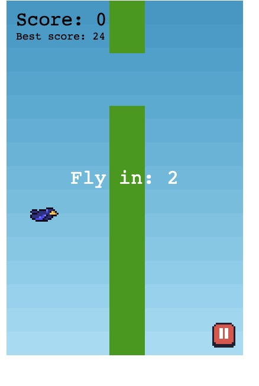

<h1 align="center">
   
  
   
  Phaser 3 TypeScript FlappyBird project
   
</h1>

This is a [Phaser 3](https://github.com/photonstorm/phaser) flappy bird project with [TypeScript](https://www.typescriptlang.org/), [Rollup](https://rollupjs.org).

## Available Commands

| Command | Description |
|---------|-------------|
| `npm run dev` | Builds project and open web server, watching for changes |
| `npm run build` | Builds code bundle with production settings  |
| `npm run serve` | Run a web server to serve built code bundle |

